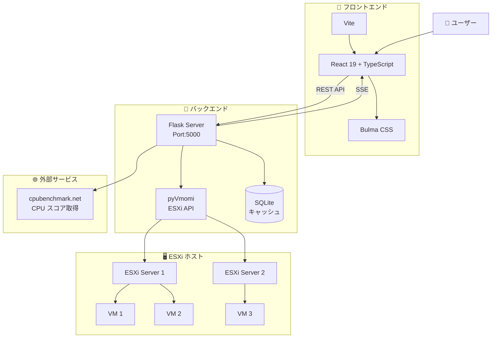
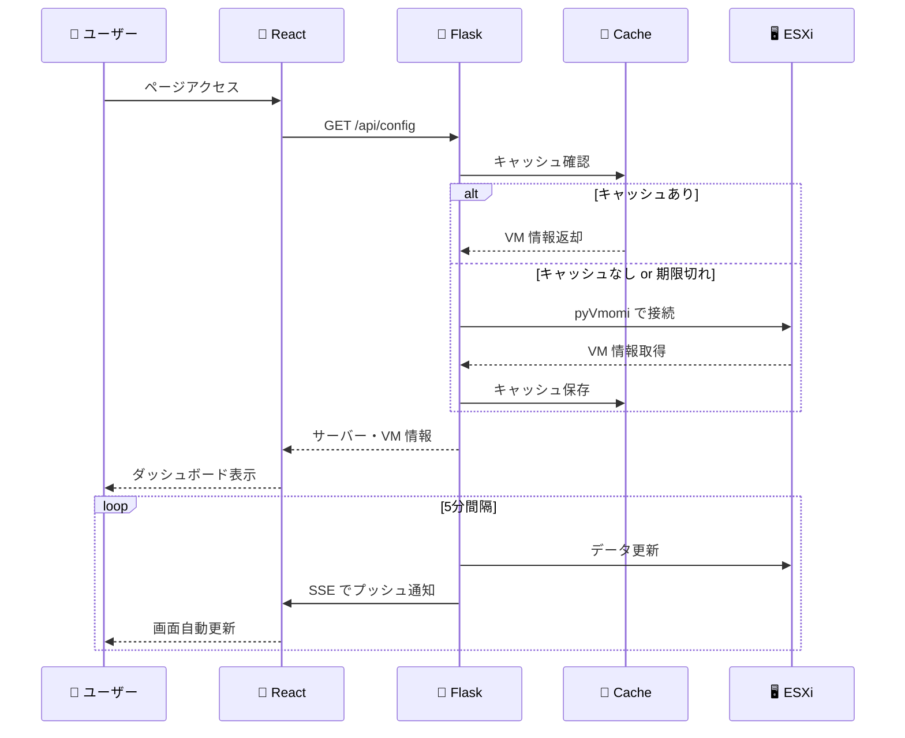

# server-list

🖥️ サーバーと仮想マシンの一覧を表示する Web アプリケーション

[](https://github.com/kimata/server-list/actions/workflows/test.yml)
[](https://kimata.github.io/server-list/pytest.html)
[](https://kimata.github.io/server-list/coverage/)

## 📋 目次

- [概要](#概要)
- [システムアーキテクチャ](#システムアーキテクチャ)
- [セットアップ](#セットアップ)
- [実行方法](#実行方法)
- [設定ファイル](#設定ファイル)
- [API エンドポイント](#api-エンドポイント)
- [テスト](#テスト)
- [CI/CD](#cicd)
- [ライセンス](#ライセンス)

## 🎯 概要

ESXi ホスト上の仮想マシン情報をリアルタイムで収集・表示するダッシュボードアプリケーションです。

### ✨ 主な機能

- 🔄 ESXi ホストからの VM 情報自動収集（5分間隔）
- 📊 CPU ベンチマークスコア表示（cpubenchmark.net から取得）
- ⏱️ システム稼働時間の表示
- 🟢 VM の電源状態に応じた表示切り替え
- 🖼️ サーバーモデル画像の表示
- 🔃 手動データ更新機能

## 🏗️ システムアーキテクチャ

### 全体構成



### データフロー



### 🗂️ モジュール構成

```
src/server_list/
├── __init__.py
├── spec/
│   ├── config.py           # 設定管理
│   ├── data_collector.py   # ESXi データ収集
│   ├── cpu_benchmark.py    # CPU スコア取得
│   ├── uptime.py           # 稼働時間管理
│   └── webapi/
│       ├── app.py          # Flask アプリ
│       ├── config.py       # /api/config
│       ├── vm.py           # /api/vm/*
│       ├── cpu.py          # /api/cpu/*
│       └── uptime.py       # /api/uptime/*
```

```
frontend/src/
├── App.tsx                 # メインアプリ
├── pages/
│   ├── HomePage.tsx        # サーバー一覧
│   └── MachineDetailPage.tsx # 詳細ページ
├── components/
│   ├── ServerCard.tsx      # サーバーカード
│   ├── VMTable.tsx         # VM テーブル
│   ├── PerformanceBar.tsx  # 性能バー
│   ├── StorageInfo.tsx     # ストレージ表示
│   └── UptimeDisplay.tsx   # 稼働時間表示
└── hooks/
    └── useEventSource.ts   # SSE フック
```

## 🛠️ セットアップ

### 必要な環境

- 🐍 Python 3.11+
- 📦 Node.js 24.x
- 🚀 uv（Python パッケージマネージャ）

### 1. 依存パッケージのインストール

```bash
# バックエンド
uv sync

# フロントエンド
cd frontend && npm ci && cd ..
```

### 2. 設定ファイルの準備

```bash
# 設定ファイルを作成
cp config.yaml.example config.yaml
cp secret.yaml.example secret.yaml
```

## 🚀 実行方法

### 🐳 Docker を使用する場合

```bash
# フロントエンドのビルド
cd frontend && npm run build && cd ..

# Docker Compose で起動
docker compose up --build
```

### 💻 Docker を使用しない場合

```bash
# フロントエンドのビルド
cd frontend && npm run build && cd ..

# サーバー起動
uv run server-list-webui -c config.yaml
```

### ⚙️ コマンドラインオプション

```
Usage:
  server-list [-c CONFIG] [-p PORT] [-D]

Options:
  -c CONFIG  設定ファイルのパス [default: config.yaml]
  -p PORT    Web サーバーのポート [default: 5000]
  -D         デバッグモードで実行
```

### 🔧 開発モード

```bash
# フロントエンド開発サーバー
cd frontend && npm run dev

# バックエンド（デバッグモード）
uv run server-list-webui -D
```

## 📝 設定ファイル

### config.yaml

```yaml
webapp:
  static_dir_path: frontend/dist
  title: Server List

machine:
  - name: server-1.example.com
    mode: ProLiant DL360 Gen10
    cpu: Intel Xeon Gold 6230
    ram: 256 GB
    os: ESXi 8.0
    esxi: https://server-1.example.com/ui/
    storage:
      - name: SSD
        model: Samsung 980 PRO
        volume: 1 TB
```

### secret.yaml

```yaml
esxi_auth:
  server-1.example.com:
    host: server-1.example.com
    username: root
    password: your_password
    port: 443
```

## 🔌 API エンドポイント

ベース URL: `/server-list/api`

### 📋 設定

| エンドポイント | メソッド | 説明 |
|---------------|---------|------|
| `/config` | GET | サーバー設定と VM 情報を取得 |

### 🖥️ VM 情報

| エンドポイント | メソッド | 説明 |
|---------------|---------|------|
| `/vm/info` | GET | 指定した VM の詳細情報を取得 |
| `/vm/info/batch` | POST | 複数 VM の情報を一括取得 |
| `/vm/host/<esxi_host>` | GET | 指定ホストの全 VM 情報を取得 |
| `/vm/refresh/<esxi_host>` | POST | 指定ホストのデータを即時更新 |

### 📊 CPU ベンチマーク

| エンドポイント | メソッド | 説明 |
|---------------|---------|------|
| `/cpu/benchmark` | GET | CPU のベンチマークスコアを取得 |
| `/cpu/benchmark/batch` | POST | 複数 CPU のスコアを一括取得 |

### ⏱️ 稼働時間

| エンドポイント | メソッド | 説明 |
|---------------|---------|------|
| `/uptime` | GET | 全ホストの稼働時間を取得 |
| `/uptime/<host>` | GET | 指定ホストの稼働時間を取得 |

### 📡 イベント

| エンドポイント | メソッド | 説明 |
|---------------|---------|------|
| `/event` | GET | Server-Sent Events でデータ更新を通知 |

## 🧪 テスト

```bash
# 全テスト実行
uv run pytest

# 型チェック
uv run python -m pyright
uv run mypy src/

# 特定のテストファイル
uv run pytest tests/unit/test_webapi_vm.py
```

### テスト構成

- `tests/unit/` - ユニットテスト
- `tests/integration/` - 結合テスト
- `tests/e2e/` - E2E テスト（Playwright）

## 🔄 CI/CD

GitHub Actions による自動テスト・デプロイ:

- 📋 **テスト結果**: https://kimata.github.io/server-list/pytest.html
- 📊 **カバレッジ**: https://kimata.github.io/server-list/coverage/

## 📄 ライセンス

Apache License Version 2.0

---

[🐛 Issue 報告](https://github.com/kimata/server-list/issues)
